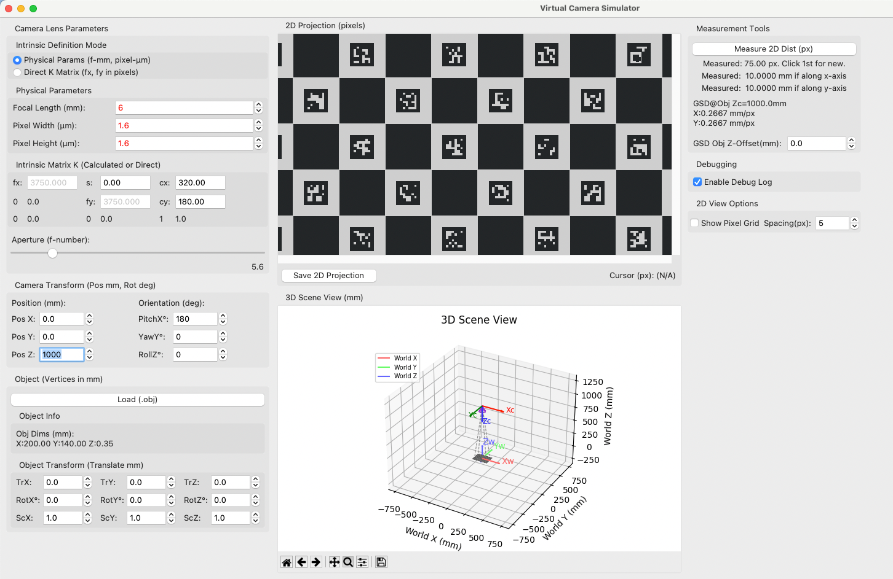

# Python Virtual Camera Simulator

Virtual Camera Simulator written in python for better understanding of the camera



## Prerequisites

Before you begin, ensure you have the following installed:

* **Python:** This project requires Python 3.12 or newer. You can download it from [python.org](https://www.python.org/downloads/).
* **Tkinter:** Tkinter is Python's standard GUI (Graphical User Interface) package. It is usually included with Python installations.
    * **To check if Tkinter is installed:** Open a Python interpreter and type:
        ```python
        import tkinter
        tkinter._test()
        ```
        If a small window appears, Tkinter is installed and working.
    * **If Tkinter is not installed or you encounter issues:**
        * **Linux (Debian/Ubuntu):**
            ```bash
            sudo apt-get update
            sudo apt-get install python3-tk
            ```
        * **Linux (Fedora):**
            ```bash
            sudo dnf install python3-tkinter
            ```
        * **macOS:** Tkinter is typically included with the official Python installers from python.org. If you installed Python via Homebrew, Tkinter should also be included. If not, reinstalling Python from python.org is often the easiest solution.
        * **Windows:** Tkinter is included by default with the Python installer from python.org. Ensure you didn't uncheck "tcl/tk and IDLE" during installation. If you did, you might need to re-run the installer and modify your installation.
* **uv:** This project uses `uv` for virtual environment management and package installation. If you don't have `uv` installed, you can install it by following the official instructions at [astral.sh/docs/uv#installation](https://astral.sh/docs/uv#installation). A common method is:
    ```bash
    # macOS and Linux
    curl -LsSf [https://astral.sh/uv/install.sh](https://astral.sh/uv/install.sh) | sh

    # Windows (PowerShell)
    irm [https://astral.sh/uv/install.ps1](https://astral.sh/uv/install.ps1) | iex
    ```
    Verify the installation with `uv --version`.

## Installation

1.  **Clone the repository (if applicable):**
    ```bash
    git clone https://github.com/anandcpanchal/python-virtual-camera-simulator.git
    cd python-virtual-camera-simulator
    ```

2.  **Create and activate a virtual environment using `uv`:**
    ```bash
    uv venv
    ```
    This will create a virtual environment named `.venv` in your project directory.

    To activate the virtual environment:
    * **macOS / Linux:**
        ```bash
        source .venv/bin/activate
        ```
    * **Windows (Command Prompt):**
        ```bash
        .venv\Scripts\activate.bat
        ```
    * **Windows (PowerShell):**
        ```bash
        .venv\Scripts\Activate.ps1
        ```
    You should see `(.venv)` at the beginning of your command prompt, indicating the virtual environment is active.

3.  **Install dependencies using `uv`:**
    Make sure your `pyproject.toml` file is present in the root of the project.
    ```bash
    uv pip install -e .
    ```
    This command installs the project in editable mode along with its dependencies defined in `pyproject.toml`. If you have a `requirements.txt` file, you can also use:
    ```bash
    # uv pip install -r requirements.txt
    ```

## Running the Application

Once the installation is complete and the virtual environment is activated, you can run the application.

```bash
python camera.py